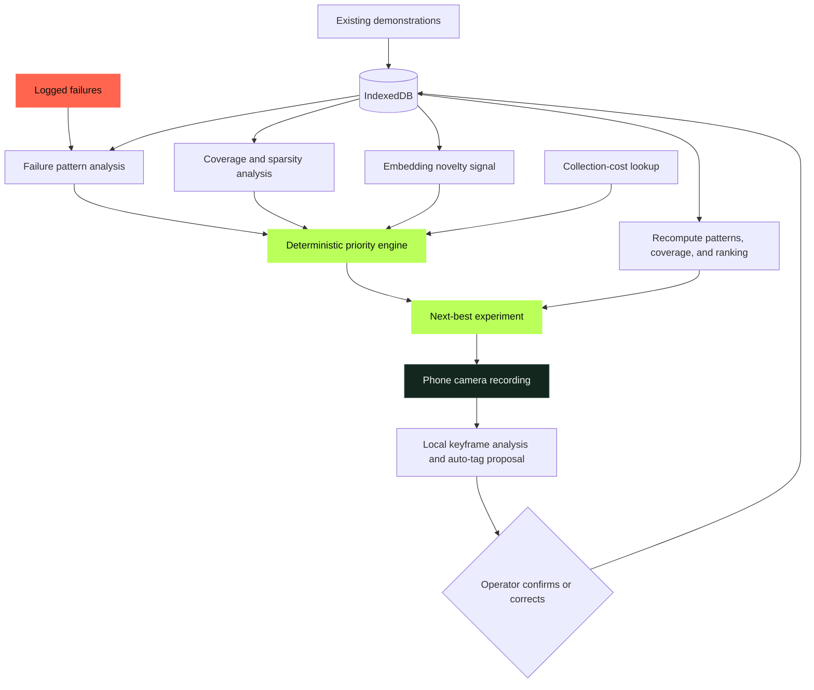

# TRACE · Data Scout

TRACE is a failure-driven data acquisition assistant for physical-AI teams. It analyzes where robot demonstrations fail, cross-references those patterns with underrepresented operating conditions, and recommends the next concrete demonstration worth recording.

The product follows one ordering:

```text
Failures → identify patterns → find underrepresented conditions → recommend next experiment
```

Coverage is an input to the decision—not the product’s framing.

## How it works



The ranking layer is deterministic and inspectable. Natural-language instructions are generated from the highest-ranked structured result; language generation does not choose the priority.

## Impact metric

The home screen reports a live, dataset-derived impact preview: current coverage versus projected coverage after recording the recommended context. The projection adds one reviewed demonstration to the selected context combination, so it is an operational planning metric rather than a claimed benchmark. During a judging demo, show the metric before capture, record or ingest the attempt, and show the recalculated coverage and next priority.

## Priority engine

For every context combination, TRACE computes:

```text
Priority(x) = (0.3 × Gap(x) + 0.5 × FailureCorrelation(x)
               + 0.2 × Novelty(x)) / CollectionCost(x)
```

Failure correlation has the largest weight so that TRACE recommends experiences related to observed breakdowns rather than merely filling empty dataset cells.

The fixed schema contains:

- Context: occlusion, lighting, object orientation, and environment
- Outcome: result and recovery presence

## Current prototype

- Installable, standalone PWA
- Camera capture through `getUserMedia` and `MediaRecorder`
- Configurable capture profiles with a 30-second default maximum and user-controlled early stop
- Capability-aware video capture with optional microphone and IMU metadata
- TensorFlow.js MobileNetV1 embeddings extracted locally from sampled keyframes using WebGL
- YOLOv8n general-object detection through ONNX Runtime Web during recording and review
- Detection evidence explaining why each auto-tag was proposed
- Optional interactive robot-arm setup preview for communicating the recommended experiment; it does not affect ranking or evidence
- Embedding-distance novelty incorporated into deterministic priority scoring
- Multi-keyframe features for brightness, texture, edge orientation, scene bias, and motion
- Auto-tag proposals with one-tap correction
- Real-time grasp kinematics simulation (standby, approach, clamp, lift & verify) with collision avoidance envelopes
- Quick Condition Testing Lab & expanded 6-DOF Spatial Workspace Inspector
- Failure-pattern and coverage matrix visualization
- Offline app-shell caching through a service worker
- Deliberately biased 20-clip seed dataset for a repeatable demonstration

The deterministic demo dataset is intentionally biased for a reproducible walkthrough. The initial scoring dimensions are defined in one schema and demonstration records accept extensible task, object, evidence, optional sensor, telemetry, and external metadata fields.

## Run locally

Camera access requires a secure origin. Browsers treat `localhost` as secure, so development works locally:

```powershell
npm run dev
```

Open [http://localhost:4173](http://localhost:4173).

For phone testing, serve the project over HTTPS or deploy it to an HTTPS host. Opening an insecure LAN address such as `http://192.168.x.x:4173` may prevent camera access.

## Build

```powershell
npm run build
```

The static production build is written to `dist/`.

## Demo loop

1. Open TRACE from its installed home-screen icon.
2. Show the failure-weighted recommendation and its numeric justification.
3. Select **Record This** and record a real manipulation attempt.
4. Review the locally proposed tags and confirm or correct them.
5. Add the clip and show TRACE recompute readiness and the next experiment.

Short recordings remain valid: the operator may stop at any point before the active task profile's maximum duration.

## Project structure

```text
TRACE/
├── app.js                 # Data store, analysis, capture, and UI behavior
├── index.html             # PWA interface
├── styles.css             # Mobile-first visual system
├── manifest.webmanifest   # Installability metadata
├── sw.js                  # App-shell cache
├── icon.svg               # PWA icon
├── scripts/build.mjs      # Dependency-free static build
└── package.json           # Development and build commands
```

## Prototype limitations

MobileNet provides the local visual embedding backbone and novelty signal. Context and outcome proposals still use lightweight, interpretable feature rules because the prototype does not yet include enough labeled robot clips to train a calibrated classifier on top of the embeddings. Proposals are intentionally reviewable. A production version should train that classifier against representative robot demonstrations and ingest robot telemetry alongside video.

YOLOv8n detects the 80 common COCO object classes; it is not an open-vocabulary detector. TRACE presents detections as evidence for reviewable tags rather than claiming metric 3D reconstruction from a single camera.

Live detection uses dedicated 320×240 camera samples, serialized model execution, and WebGPU/WebNN when available with a multithreaded WASM fallback on cross-origin-isolated deployments. MobileNet embedding work is deferred until capture stops so the two models do not contend during recording.

After capture, ambiguous COCO detections such as book/cell phone and laptop/TV are rechecked using MobileNet crop classification and stabilized with temporal label voting. Live boxes remain YOLO-only to preserve recording responsiveness.

## Model attribution

- TensorFlow.js and MobileNet: Apache-2.0
- ONNX Runtime Web: MIT
- YOLOv8n model architecture and weights: Ultralytics; review the current Ultralytics licensing terms before commercial distribution
- Browser-ready YOLOv8n ONNX conversion sourced from `Hyuto/yolov8-onnxruntime-web`
