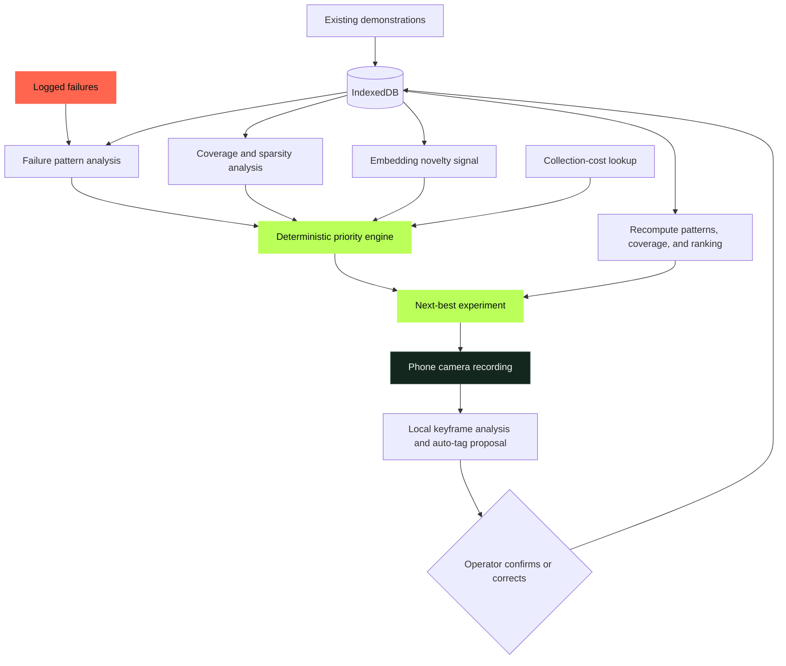

# TRACE · Data Scout

TRACE is a failure-driven data acquisition assistant for physical-AI teams. It analyzes where robot demonstrations fail, cross-references those patterns with underrepresented operating conditions, and recommends the next concrete demonstration worth recording.

The product follows one ordering:

```text
Failures → identify patterns → find underrepresented conditions → recommend next experiment
```

Coverage is an input to the decision—not the product’s framing.

## How it works



The ranking layer is deterministic and inspectable. Natural-language instructions are generated from the highest-ranked structured result; language generation does not choose the priority.

## Priority engine

For every context combination, TRACE computes:

```text
Priority(x) = (0.3 × Gap(x) + 0.5 × FailureCorrelation(x)
               + 0.2 × Novelty(x)) / CollectionCost(x)
```

Failure correlation has the largest weight so that TRACE recommends experiences related to observed breakdowns rather than merely filling empty dataset cells.

The fixed schema contains:

- Context: occlusion, lighting, object orientation, and environment
- Outcome: result and recovery presence

## Current prototype

- Installable, standalone PWA
- Camera capture through `getUserMedia` and `MediaRecorder`
- Multi-keyframe local analysis for brightness, texture, edge orientation, scene bias, and motion
- Auto-tag proposals with one-tap correction
- Interactive 3D physical workcell simulator with 60 FPS trajectory playback, Lambertian shading, drop shadows, and multi-angle camera presets (ISO, TOP, FRONT, TCP)
- Real-time grasp kinematics simulation (standby, approach, clamp, lift & verify) with collision avoidance envelopes
- Quick Condition Testing Lab & expanded 6-DOF Spatial Workspace Inspector
- Failure-pattern and coverage matrix visualization
- Offline app-shell caching through a service worker
- Deliberately biased 20-clip seed dataset for a repeatable demonstration

The seed data and attribute schema are intentionally fixed. Recommendations, coverage, explanations, inferred capture tags, and post-capture ranking are computed from the current IndexedDB contents.

## Run locally

Camera access requires a secure origin. Browsers treat `localhost` as secure, so development works locally:

```powershell
npm run dev
```

Open [http://localhost:4173](http://localhost:4173).

For phone testing, serve the project over HTTPS or deploy it to an HTTPS host. Opening an insecure LAN address such as `http://192.168.x.x:4173` may prevent camera access.

## Build

```powershell
npm run build
```

The static production build is written to `dist/`.

## Demo loop

1. Open TRACE from its installed home-screen icon.
2. Show the failure-weighted recommendation and its numeric justification.
3. Select **Record This** and record a real manipulation attempt.
4. Review the locally proposed tags and confirm or correct them.
5. Add the clip and show TRACE recompute readiness and the next experiment.

## Project structure

```text
TRACE/
├── app.js                 # Data store, analysis, capture, and UI behavior
├── index.html             # PWA interface
├── styles.css             # Mobile-first visual system
├── manifest.webmanifest   # Installability metadata
├── sw.js                  # App-shell cache
├── icon.svg               # PWA icon
├── scripts/build.mjs      # Dependency-free static build
└── package.json           # Development and build commands
```

## Prototype limitations

The current auto-tagger uses lightweight visual and temporal heuristics rather than a trained embedding classifier. Its proposals are intentionally reviewable. A production version should replace these heuristics with a calibrated on-device embedding model trained against representative robot demonstrations and should ingest robot telemetry alongside video.

